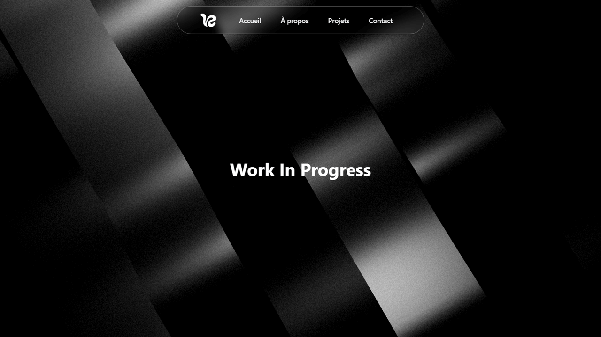

# Valentin Gil – Portfolio

Bienvenue sur le portfolio de Valentin Gil, étudiant en BUT Métiers du Multimédia et de l'Internet à l'IUT d'Angoulême.



## 🚀 Aperçu

Ce site présente mes projets, compétences et expériences dans le domaine du web, du design et du développement front-end.

- **Stack** : Next.js 15, React, Tailwind CSS 4, TypeScript
- **Design** : Responsive, dark/light mode, animations Three.js
- **SEO** : Métadonnées, sitemap, JSON-LD, accessibilité optimisée
- **Hébergement** : Vercel

## ✨ Fonctionnalités principales

- Navigation fluide et animée
- Section projets avec visuels interactifs
- Pages légales (mentions légales, politique de confidentialité)
- Mode sombre/clair automatique
- Analytics Vercel intégrés

## 📦 Installation locale

```bash
pnpm install
pnpm dev
```

Le site sera accessible sur [http://localhost:3000](http://localhost:3000).

## 🛠️ Scripts utiles

- `pnpm dev` : Démarre le serveur de développement
- `pnpm build` : Build de production
- `pnpm lint` : Lint du code avec ESLint

## 🌐 Déploiement

Le site est déployé automatiquement sur Vercel à chaque push sur la branche `main`.

## 📄 Mentions légales & RGPD

- [Mentions légales](/mentions-legales)
- [Politique de confidentialité](/politique-confidentialite)

## 👤 Auteur

- [Valentin Gil](https://vgil.fr)
- [LinkedIn](https://www.linkedin.com/in/valentin-gil/)

---

© 2025 Valentin Gil. Tous droits réservés.
